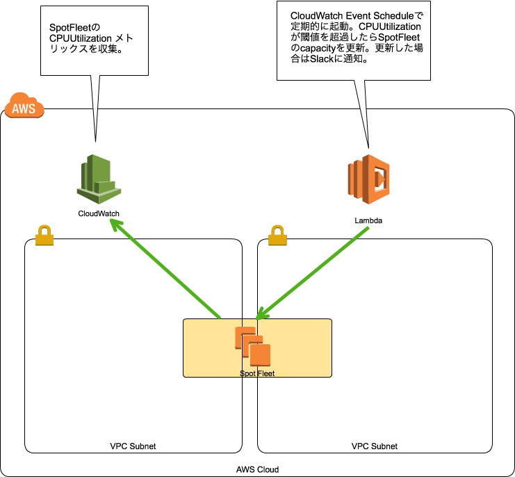
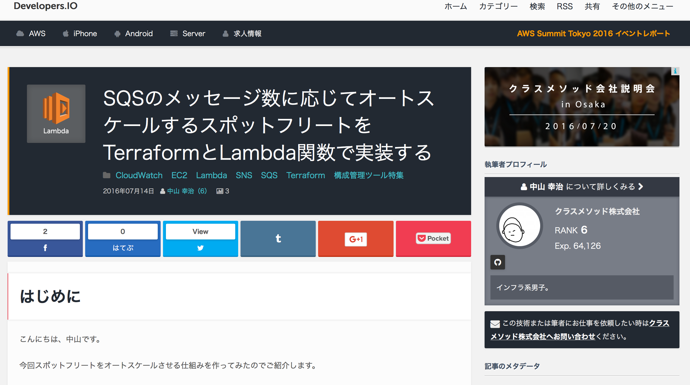

layout: true
class: center, middle

---
# Lambda関数でスポットフリートをオートスケールさせたいだけの人生だった
## knakayama

---
# 自己紹介

---
# knakayama(中山 幸治)&nbsp;
## [https://knakayama.github.io](https://knakayama.github.io)

---
# クラスメソッド AWSコンサルティング部 所属

---
# 今日の資料↓に置いときました
### [https://knakayama.github.io/LT-2016-07-22](https://knakayama.github.io/LT-2016-07-22)

---
layout: true
class: center, middle

---
# アジェンダ

---
layout: true
class: middle

---
## 1. スポットフリートについて
## 2. Lambda関数について
## 3. やってみた

---
layout: true
class: center, middle

---
# スポットフリートについて

---
# その前にスポットインスタンスについて

---
layout: true
class: middle

---
### スポットインスタンスプール(余剰インスタンス)を使う仕組み
### 余剰インスタンスの値段(スポット価格)に入札して利用する
### スポット価格は需要と供給により決まる
### 入札額がスポット価格を上回ったら利用可能
### 入札額がスポット価格を下回ったらterminate
### オンデマンドインスタンスよりコストを大幅に抑えられる

---
layout: true
class: center, middle

---
## 入札成功パターン  

---
## 入札失敗パターン  

---
layout: true
class: middle

---
### スポットリクエスト(入札方式)には2種類ある(一時/永続)
### 即terminateさせない仕組み(スポットブロック)もある
### オンデマンドインスタンスに比べて起動が遅い
### サーバをステートレスにしてterminateに備える必要あり
### terminateの2分前に警告してくれる(メタデータで取得可能)

---
layout: true
class: center, middle

---
# Demo
### 実際にスポットインスタンス使ってみる

---
# スポットフリートについて (2度目)

---
layout: true
class: middle

---
### 複数のスポットリクエストをまとめて管理する仕組み
### スポットインスタンスの希望台数(capacity)を指定可能
### capacityを維持するようにいい感じに調整してくれる
### 例 あるリクエストが無効になったら別のリクエストで起動

---
layout: true
class: center, middle

---
### スポットフリートイメージ図  

---
layout: true
class: middle

---
### インスタンスの配分(起動)方法を指定可能
### 配分戦略は2つ(lowestprice/diversified)
### 特定のリクエストに重み付け(WeightedCapacity)可能
### 重みが小さいリクエストを優先して起動させる(デフォルト1)
### 入札価格はリクエストに応じて2種類指定可能(全体/特定)

---
layout: true
class: center, middle

---
# Demo
### 実際にスポットフリート使ってみる

---
# Lambda関数について

---
layout: true
class: middle

---
### 関数単位で処理を実行できるAWSサービス
### サーバを立てる必要が無いので運用コスト低減可能
### 処理時間単位の従量課金製なのでEC2より圧倒的にお得
### 現時点でNode.js/Python/Javaに対応
### 他AWSサービスとの連携も可能
### 例 S3にデータ保存したらLambda起動してデータ変換

---
layout: true
class: center, middle

---
# やってみた
### スポットフリートをオートスケールさせてみる

---
layout: true
class: middle

---
### スポットフリートはASGと少し似ている
### でも決定的に違うところがある
### オートスケールに標準で対応してない点
### そこをLambda関数を利用してオートスケールさせる

---
layout: true
class: center, middle

---
### 構成図

#### [https://github.com/knakayama/lambda-auto-scaling-spot-fleet-based-on-cpu-usage](https://github.com/knakayama/lambda-auto-scaling-spot-fleet-based-on-cpu-usage)

---
### 細かい使い方とかは↓見てください

---
background-image: url(http://img.laughy.jp/6483/default_0613a3bc790c703d04177aa6db0153ac.jpg)

---
background-image: url(http://img.laughy.jp/6483/default_0613a3bc790c703d04177aa6db0153ac.jpg)
# **スポットフリート先生の 今後にご期待ください**
